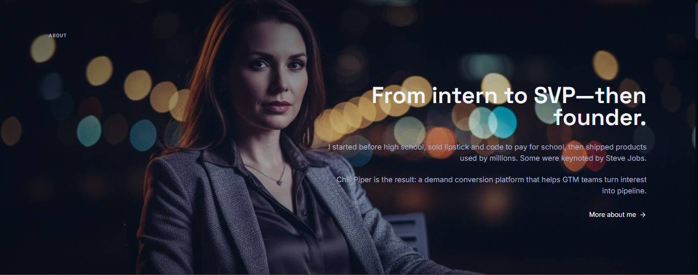
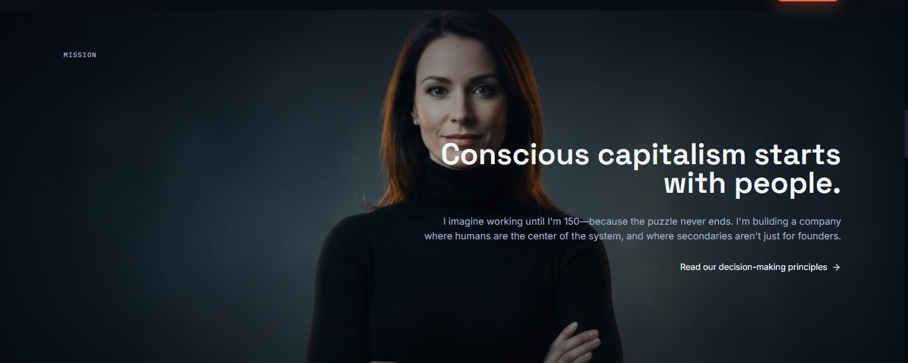

# Alina Vandenberghe


## Technology Leader • Entrepreneur • Product Visionary

---

## Table of Contents

- [About](#about)
- [Live Preview](#live-preview)
- [Features](#features)
- [Tech Stack](#tech-stack)
- [Installation](#installation)

## About



This project is a modern introduction landing page presenting the professional journey, leadership influence, and technology contributions of Alina Vandenberghe.

The page is built with strong focus on performance, accessibility, and high quality user experience.

---

## Live Preview

👉 **[Visit Intro Page](https://your-domain.com )**

---

## Features

- Fully responsive layout
- Edge optimized deployment
- Smooth UI animations
- SEO ready architecture
- Mobile first design
- Global CDN acceleration

---

## Tech Stack

| Layer | Technology |
| ----------- | ------------ |
| Framework | React / Vite.js |
| Styling | Tailwind CSS |
| Components | Shadcn UI |
| Animations | Framer Motion |
| Animations | Three JS |
| Deployment | Cloudflare Workers |
| CDN | Cloudflare Edge Network |

---

## Mission



---

## Resources


---

## Installation

### Clone Repository

```bash
git clone https://github.com/seriouscodehere/alina_intro.git
